# Previsão de Riscos Cardíacos

Bem-vindo à documentação do projeto de análise de dados e classificação de doenças cardíacas. Este projeto utiliza várias bibliotecas de aprendizado de máquina para analisar e prever a presença de doenças cardíacas com base em um conjunto de dados.

# Aquisição de bibliotecas e dados necessários ao projeto.

Nesta seção, será importado todas as bibliotecas utilizadas durante o projeto, além do arquivo `csv` com os dados de treinamento.

## Importação das Bibliotecas

Aqui, estamos importando todas as bibliotecas necessárias para manipulação de dados, visualização e aprendizado de máquina.

```python
import pandas as pd
import matplotlib.pyplot as plt 
import seaborn as sns
from sklearn.preprocessing import RobustScaler, LabelEncoder
from sklearn.model_selection import train_test_split, cross_val_score
from sklearn.linear_model import LogisticRegression
from sklearn.neighbors import KNeighborsClassifier
from sklearn.tree import DecisionTreeClassifier
from sklearn.ensemble import RandomForestClassifier, GradientBoostingClassifier
from sklearn.naive_bayes import GaussianNB
from sklearn.model_selection import train_test_split, GridSearchCV
from sklearn.metrics import accuracy_score, f1_score, make_scorer
```

## Carregamento dos Dados

Carregamos o conjunto de dados heart.csv e configuramos o pandas para mostrar todas as linhas ao imprimir o DataFrame.

```python
df = pd.read_csv("./heart.csv")
pd.set_option('display.max_rows', None)
```

## Verificação dos Dados

Imprimimos o DataFrame, verificamos os tipos de dados, informações gerais e a presença de valores nulos.

O comando `dtypes` mostra os tipos de dados em cada coluna do DataFrame.

`df.info()` fornece informações gerais sobre o DataFrame, incluindo o número de entradas não nulas em cada coluna.

`df.isnull().sum()` retorna a contagem de valores nulos em cada coluna do DataFrame.

```python
df.dtypes
df.info()
df.isnull().sum()
```

# Análise Exploratória

Nessa fase, analisamos as distribuições das colunas do conjunto de dados.

Esse código gera um gráfico de barras para a coluna `output`. Repetimos o processo para outras colunas categóricas (`sex`, `cp`, `fbs`, `restecg`, `exng`, `slp`, `thall`).

## Output

```python
plt.figure(figsize=(8, 6))
column = "output"
df[column].value_counts().plot(kind='bar', color='skyblue')
plt.title(f'Contagem de valores em {column}')
plt.xlabel(column)
plt.ylabel('Contagem')
plt.xticks(rotation=0)
plt.show()
```

<div style="text-align: center;">
    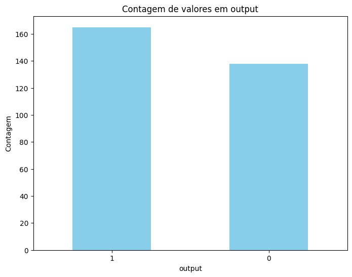
    <p style="margin-top: 10px; font-size: 12px; font-weight: bold;">Figura 1 - Valores da coluna output.</p>
</div>

## Sex

```python
plt.figure(figsize=(8, 6))
column = "sex"
df[column].value_counts().plot(kind='bar', color='skyblue')
plt.title(f'Contagem de valores em {column}')
plt.xlabel(column)
plt.ylabel('Contagem')
plt.xticks(rotation=0)
plt.show()
```

<div style="text-align: center;">
    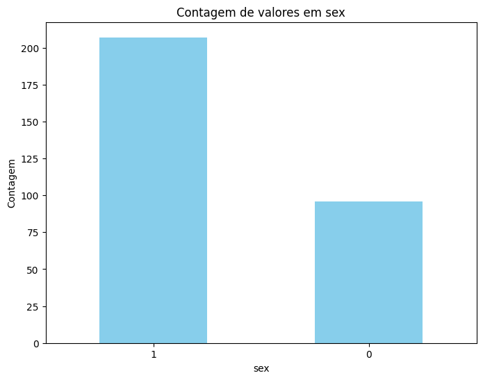
    <p style="margin-top: 10px; font-size: 12px; font-weight: bold;">Figura 2 - Valores da coluna sex.</p>
</div>

## CP

```python
plt.figure(figsize=(8, 6))
column = "cp"
df[column].value_counts().plot(kind='bar', color='skyblue')
plt.title(f'Contagem de valores em {column}')
plt.xlabel(column)
plt.ylabel('Contagem')
plt.xticks(rotation=0)
plt.show()
```

<div style="text-align: center;">
    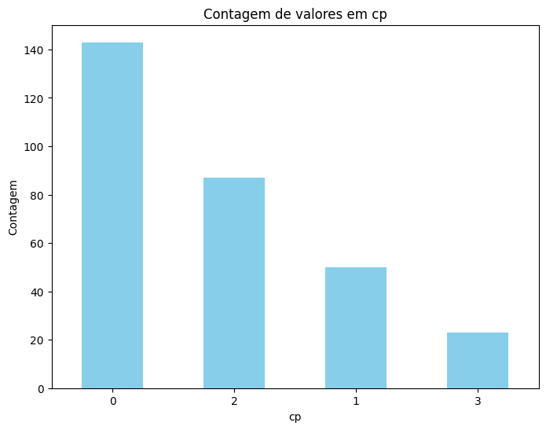
    <p style="margin-top: 10px; font-size: 12px; font-weight: bold;">Figura 3 - Valores da coluna cp.</p>
</div>

## FBS

```python
plt.figure(figsize=(8, 6))
column = "fbs"
df[column].value_counts().plot(kind='bar', color='skyblue')
plt.title(f'Contagem de valores em {column}')
plt.xlabel(column)
plt.ylabel('Contagem')
plt.xticks(rotation=0)
plt.show()
```

<div style="text-align: center;">
    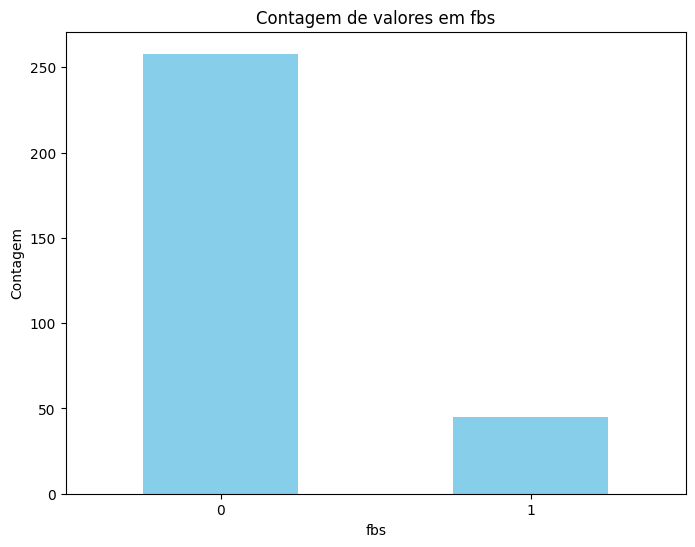
    <p style="margin-top: 10px; font-size: 12px; font-weight: bold;">Figura 4 - Valores da coluna fbs.</p>
</div>

## RESTECG

```python
plt.figure(figsize=(8, 6))
column = "restecg"
df[column].value_counts().plot(kind='bar', color='skyblue')
plt.title(f'Contagem de valores em {column}')
plt.xlabel(column)
plt.ylabel('Contagem')
plt.xticks(rotation=0)
plt.show()
```

<div style="text-align: center;">
    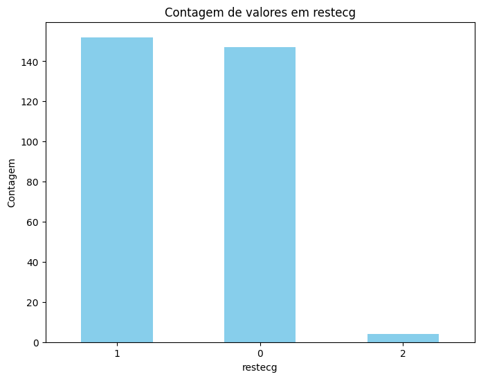
    <p style="margin-top: 10px; font-size: 12px; font-weight: bold;">Figura 5 - Valores da coluna restecg.</p>
</div>

## EXNG

```python
plt.figure(figsize=(8, 6))
column = "exng"
df[column].value_counts().plot(kind='bar', color='skyblue')
plt.title(f'Contagem de valores em {column}')
plt.xlabel(column)
plt.ylabel('Contagem')
plt.xticks(rotation=0)
plt.show()
```

<div style="text-align: center;">
    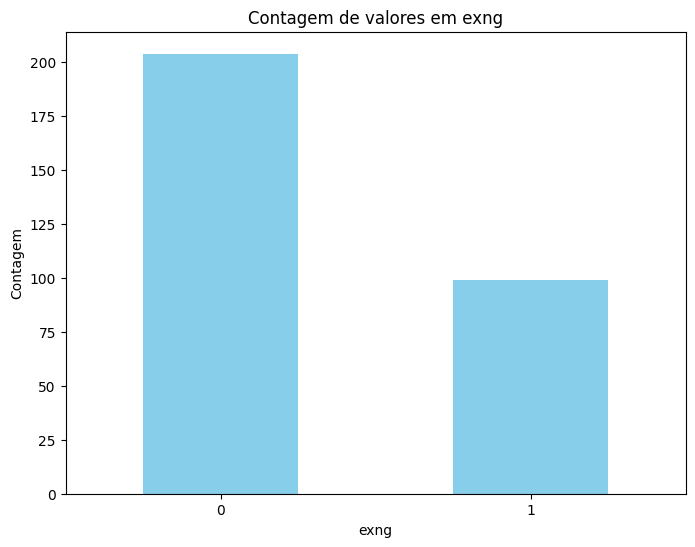
    <p style="margin-top: 10px; font-size: 12px; font-weight: bold;">Figura 6 - Valores da coluna exng.</p>
</div>

## SLP

```python
plt.figure(figsize=(8, 6))
column = "slp"
df[column].value_counts().plot(kind='bar', color='skyblue')
plt.title(f'Contagem de valores em {column}')
plt.xlabel(column)
plt.ylabel('Contagem')
plt.xticks(rotation=0)
plt.show()
```

<div style="text-align: center;">
    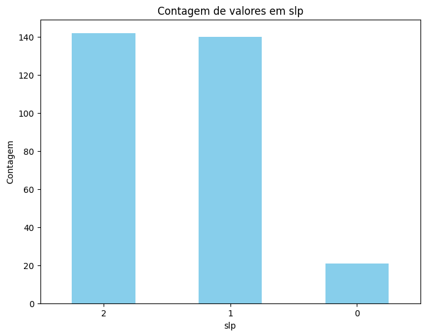
    <p style="margin-top: 10px; font-size: 12px; font-weight: bold;">Figura 7 - Valores da coluna slp.</p>
</div>

## THALL

```python
plt.figure(figsize=(8, 6))
column = "thall"
df[column].value_counts().plot(kind='bar', color='skyblue')
plt.title(f'Contagem de valores em {column}')
plt.xlabel(column)
plt.ylabel('Contagem')
plt.xticks(rotation=0)
plt.show()
```

<div style="text-align: center;">
    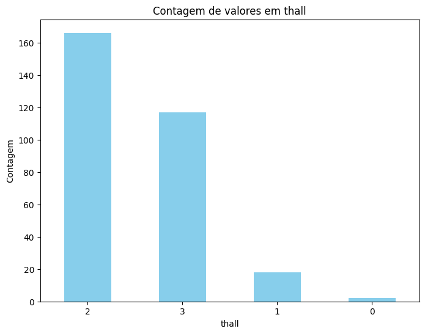
    <p style="margin-top: 10px; font-size: 12px; font-weight: bold;">Figura 8 - Valores da coluna thall.</p>
</div>

## Distribuição normal de todas as colunas

Observa-se a necessidade de normalizar os dados, devido a muitas features não estarem na distribuicao normal.

```python
plt.figure(figsize=(20, 15))
for grafico, feature in enumerate(df.columns, 1):
    plt.subplot(5, 3, grafico)
    plt.title(f"Distribuição dos dados da coluna {feature}")
    sns.histplot(df[feature], kde=True)
    plt.tight_layout()
    plt.plot()
```

<div style="text-align: center;">
    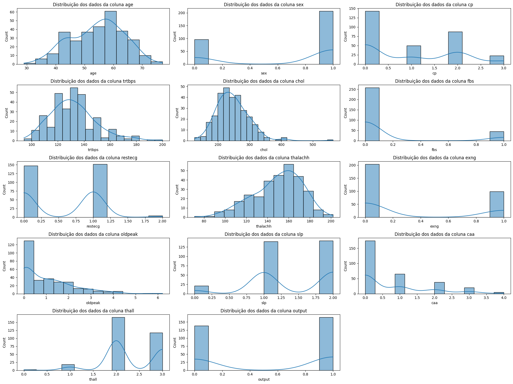
    <p style="margin-top: 10px; font-size: 12px; font-weight: bold;">Figura 9 - Distribuição normal de todas as colunas.</p>
</div>

# Preparação dos Dados

Nessa fase, os dados serão preparados para a modelagem de aprendizado de máquina. Será realizado a limpeza dos dados, tratando valores, correção de outliers, codificação de variáveis categóricas e normalização.

## Normalização dos Dados

Aqui, os dados serão normalizados usando RobustScaler e aplicamos get_dummies para transformar colunas categóricas em variáveis dummy.

```python
categorias = ['sex','exng','caa','cp','fbs','restecg','slp','thall']
valores_numericos = ['age','trtbps','chol','thalachh','oldpeak']

df = pd.get_dummies(df, columns=categorias, drop_first=True)

X = df.drop(['output'], axis=1)
y = df[['output']]

y = y.values.reshape(-1)

rs = RobustScaler()
X[valores_numericos] = rs.fit_transform(X[valores_numericos])
```

## Visualização dos Dados Normalizados

Visualizamos a distribuição das colunas após a normalização.

```python
plt.figure(figsize=(15, 20))

for grafico, feature in enumerate(df.columns, 1):
    plt.subplot(10, 3, grafico)
    plt.title(f"Distribuição dos dados da coluna {feature}")
    sns.histplot(df[feature], kde=True)
    plt.tight_layout()
    plt.plot()
```

<div style="text-align: center;">
    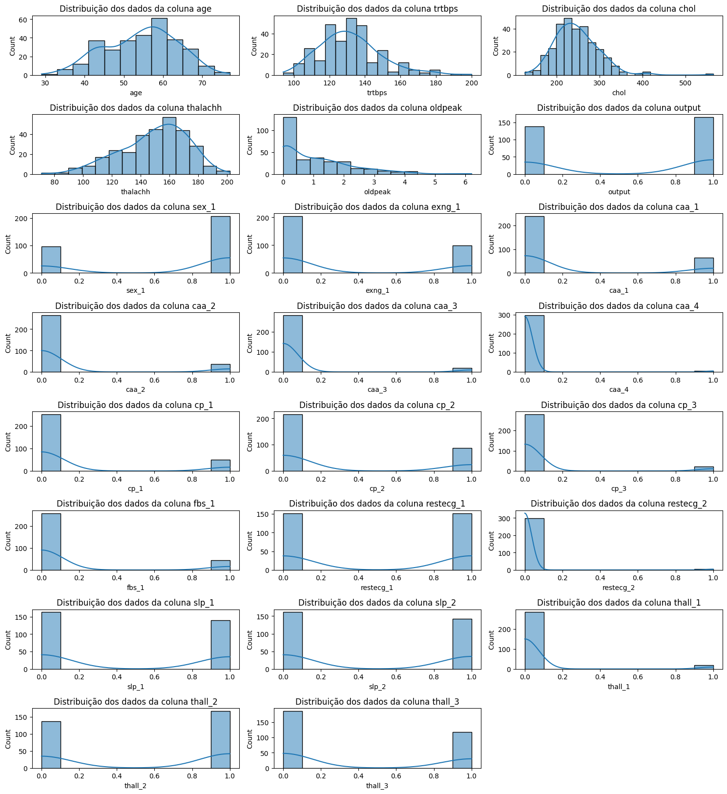
    <p style="margin-top: 10px; font-size: 12px; font-weight: bold;">Figura 10 - Distribuição das colunas após normalização.</p>
</div>

## Separação dos Dados

Separamos os dados em conjuntos de treinamento e teste.

```python
X_train, X_test, y_train, y_test = train_test_split(X, y, test_size=0.3, random_state=42)
```

# Treinamento de Modelos

Definimos uma lista de modelos para serem avaliados. Após uma pesquisa em grupo, foi selecionado uma lista de modelos de classificação binária que se adequavam ao problema a ser resolvido, sendo eles `Logistic Regression`, `Gradient Boosting`, `KNeighbors Classifier`, `Decision Tree Classifier`, `Random Forest`, `Naive Bayes Classifier`.

## Lista de Modelos

```python
models = [
    ('Logistic Regression', LogisticRegression(random_state=42)),
    ('Gradient Boosting', GradientBoostingClassifier(random_state=42)),
    ('KNeighbors Classifier', KNeighborsClassifier()),
    ('Decision Tree Classifier', DecisionTreeClassifier(random_state=42)),
    ('Random Forest', RandomForestClassifier(random_state=42)),
    ('Naive Bayes Classifier', GaussianNB())
]
```

## Treinamento e Avaliação dos Modelos

Neste trecho do código, treinamos cada modelo, calculamos a acurácia e o F1-score, e determinamos o melhor modelo com base nessas métricas.

```python
best_f1_model = None
f1 = 0.0
best_f1_score = 0.0
best_accuracy_model = None
accuracy = 0.0
best_accuracy = 0.0

for name, model in models:
    model.fit(X_train, y_train)
    y_pred = model.predict(X_test)
    accuracy = accuracy_score(y_test, y_pred)
    f1 = f1_score(y_test, y_pred)
    print("Model:    ", name)
    print("Accuracy: ", accuracy)
    print("F1-Score: ", f1, "\n")
    if f1 > best_f1_score:
        best_f1_score = f1
        best_f1_model = name
    if accuracy > best_accuracy:
        best_accuracy = accuracy
        best_accuracy_model = name

print("Best Model by F1-Score: ", best_f1_model)
print("Best Model by Accuracy: ", best_accuracy_model)
```

Verificou-se que os algoritmos regressão logística e KNeighbors e obteveram os melhores resultados de acurácia e F1-Score. Destacando o algoritmo de regressão logística que se mostrou muito promissor.

<div style="text-align: center;">
    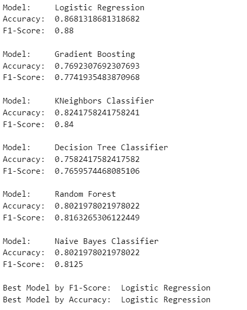
    <p style="margin-top: 10px; font-size: 12px; font-weight: bold;">Figura 11 - Resultado do treinamento.</p>
</div>

# Ajuste de Hiperparâmetros

Nesta seção, é realizado o ajuste de hiperparâmetros para melhorar o desempenho dos modelos. Para cada modelo, foram levantados os hiperparâmetros mais promissores visando aumentar o desempenho dos mesmos

Em seguida, foi aplicado o método de validação cruzada, dividindo o conjunto de dados em cinco partes para evitar o overfitting

## Ajuste de Hiperparâmetros com GridSearchCV

Neste trecho, usamos GridSearchCV para encontrar os melhores parâmetros para cada modelo, maximizando o F1-score.

```python
new_models = [
    ('Logistic Regression', LogisticRegression(random_state=42)),
    ('Gradient Boosting', GradientBoostingClassifier(random_state=42)),
    ('KNeighbors Classifier', KNeighborsClassifier()),
    ('Decision Tree Classifier', DecisionTreeClassifier(random_state=42)),
    ('Random Forest', RandomForestClassifier(random_state=42)),
    ('Naive Bayes Classifier', GaussianNB())
]

def hyperparameter_tuning(X_train, X_test, y_train, y_test, models):
    results = {}

    for model_name, model in models:
        param_grid = {}
        if model_name == 'Logistic Regression':
            param_grid = {'C': [0.001, 0.01, 0.1, 1, 10, 100]}
        elif model_name == 'KNeighbors Classifier':
            param_grid = {'n_neighbors': [3, 5, 7, 9]}
        elif model_name == 'Naive Bayes Classifier':
            param_grid = {'var_smoothing': [1e-9, 1e-8, 1e-7, 1e-6]}
        elif model_name == 'Decision Tree Classifier':
            param_grid = {'max_depth': [None, 10, 20, 30], 'min_samples_split': [2, 5, 10]}
        elif model_name == 'Random Forest':
            param_grid = {'n_estimators': [100, 200, 300], 'max_depth': [None, 10, 20, 30], 'min_samples_split': [2, 5, 10]}
        elif model_name == 'Gradient Boosting':
            param_grid = {'learning_rate': [0.01, 0.1, 0.2], 'n_estimators': [100, 200, 300], 'max_depth': [3, 5, 7]}

        scoring = {'Accuracy': make_scorer(accuracy_score), 'F1': make_scorer(f1_score, average='macro')}
        
        grid_search = GridSearchCV(model, param_grid, cv=5, scoring=scoring, refit='F1')
        grid_search.fit(X_train, y_train)
        
        best_params = grid_search.best_params_
        best_model = grid_search.best_estimator_
        test_accuracy = best_model.score(X_test, y_test)
        y_pred = best_model.predict(X_test)
        test_f1 = f1_score(y_test, y_pred, average='macro')
        
        results[model_name] = {
            'best_params': best_params,
            'validation_accuracy': grid_search.cv_results_['mean_test_Accuracy'][grid_search.best_index_],
            'validation_f1': grid_search.cv_results_['mean_test_F1'][grid_search.best_index_],
            'test_accuracy': test_accuracy,
            'test_f1': test_f1,
        }
    
    return results
    
results = hyperparameter_tuning(X_train, X_test, y_train, y_test, new_models)
```

Em seguida, visualizamos os resultados.

```python
for model_name, info in results.items():
    print(f"Model: {model_name}")
    print(f"Best Parameters: {info['best_params']}")
    print(f"Validation Accuracy: {info['validation_accuracy']:.4f}")
    print(f"Validation F1: {info['validation_f1']:.4f}")
    print(f"Test Accuracy: {info['test_accuracy']:.4f}")
    print(f"Test F1: {info['test_f1']:.4f}")
    print("-" * 40)
```

<div style="text-align: center;">
    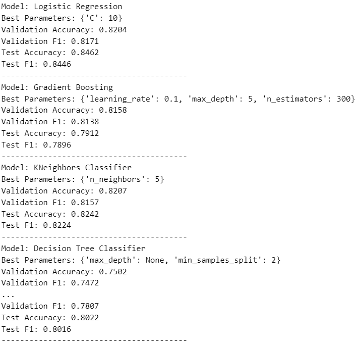
    <p style="margin-top: 10px; font-size: 12px; font-weight: bold;">Figura 12 - Resultado do treinamento após ajuste de hiperparâmetros.</p>
</div>

## Resultado

Entre os modelos avaliados, o Logistic Regression apresentou o melhor desempenho geral, com uma acurácia de 0.8204 e um score F1 de 0.8462, indicando um excelente equilíbrio entre precisão e recall.

## Bibliografia

Janosi,Andras, Steinbrunn,William, Pfisterer,Matthias, and Detrano,Robert. (1988). Heart Disease. UCI Machine Learning Repository. [https://doi.org/10.24432/C52P4X](https://doi.org/10.24432/C52P4X)
.


